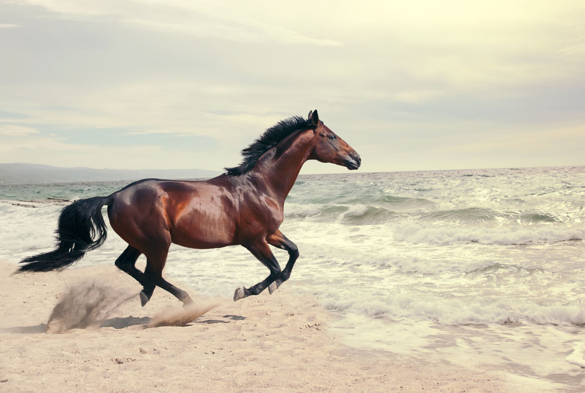
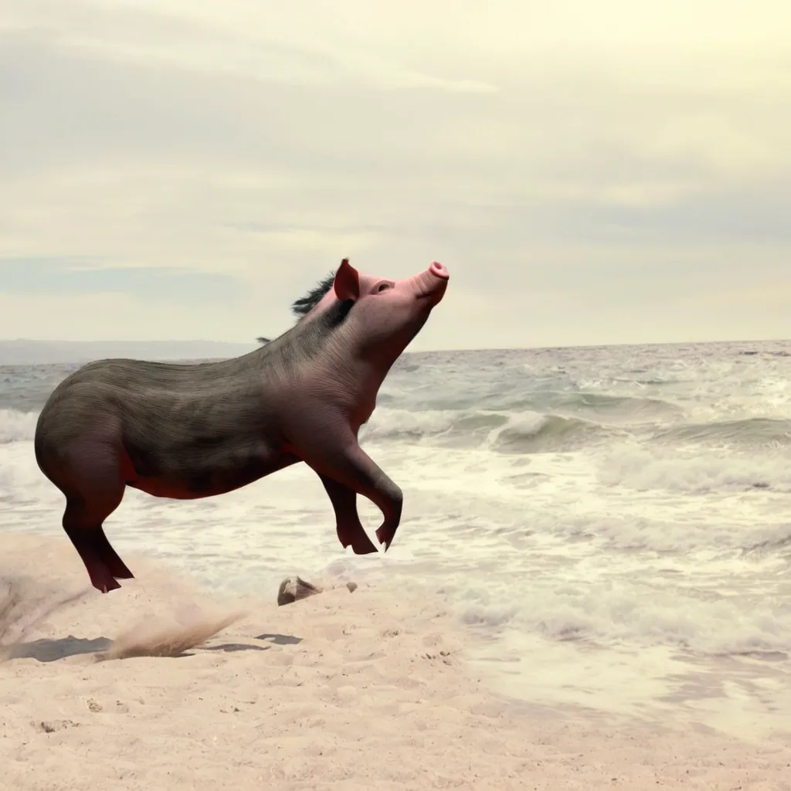
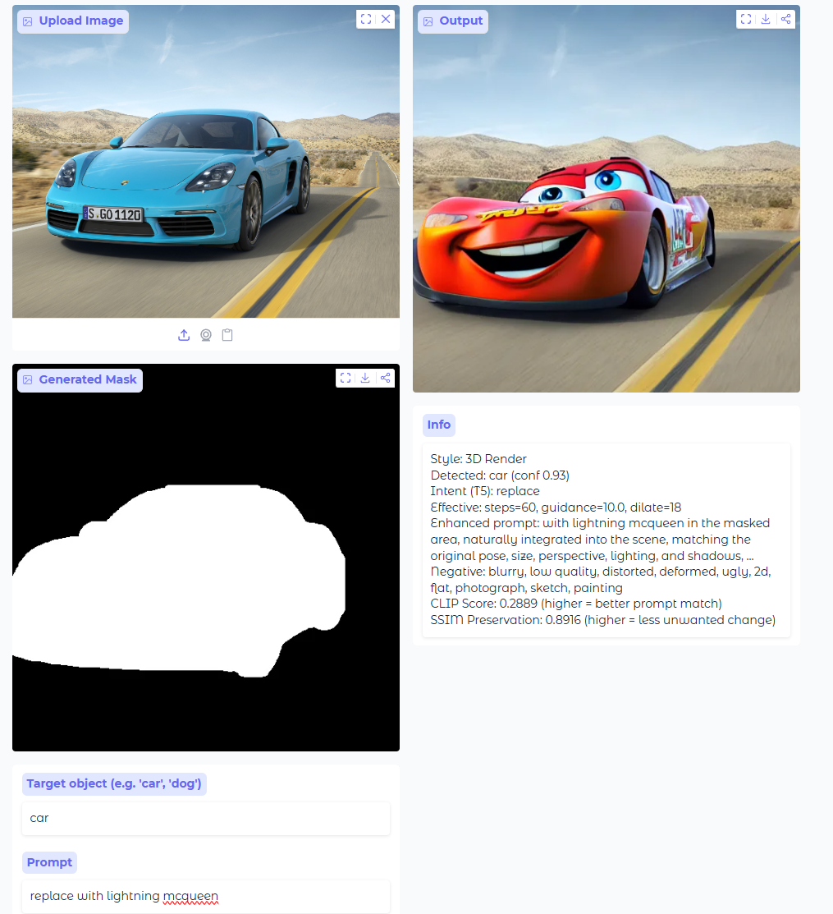
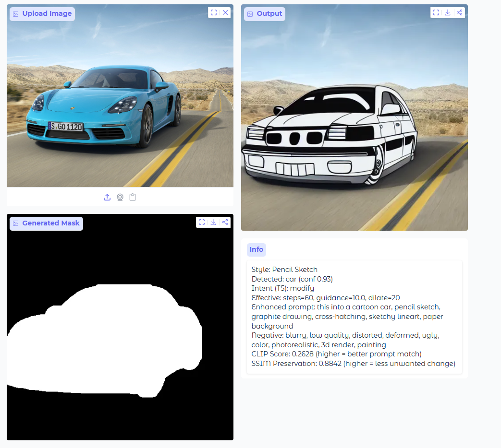

# M.A.G.E - Masked And Generative Editor

Presentation Link: [To View Presentation Video CLICK HERE](https://youtu.be/VJn_2BHbwCs)


| Name | Student Number |
| ----------- | ----------- |
| Adam Kolodziejczak | 100874535 |
| Jeremy Thummel | 100874310 |
| Tyson Grant | 100875284

Group ID's given to each member:

Adam - Group ID 21
Tyson - Group ID 22
Jeremy - Group ID 23

## The Problem
Traditional image editing requires the user to select regions of an image using a magic wand or lasso tool, then hand-craft layers or images to replace or distort these images. Traditional techniques do not have a grasp on what objects are, or what they are being replaced with.

Using AI-guided image editing with stable diffusion, it allows inpatining to detect and mask a region to then replace this area using a text-guided prompt. This allows for more efficient image editing and gives a AI creative-touch to the final output, saving the user time from having to manually create an image to overlay.
M.A.G.E. utilizes a multi-model pipeline to process, enhance, and evaluate your edits:

* **Stable Diffusion In-Painting (`stable-diffusion-v1-5`):** The core generative engine that seamlessly fills in masked areas based on text prompts.
* **YOLO (`yolo11s-seg`):** Powers the Auto-Masking feature by semantically detecting target objects and generating precise segmentation masks (or bounding boxes).
* **T5 (`google/flan-t5-base`):** A Large Language Model used to dynamically enhance user prompts with rich descriptive details and classify the user's editing intent (replace, remove, add, modify).
* **CLIP (`openai/clip-vit-base-patch32`):** Computes a cosine similarity score to measure how accurately the final output image matches the provided text prompt.

*(Note: We also use **SSIM (Structural Similarity Index Measure)** to score "Preservation," ensuring the unmasked background remains untouched).*

---

## Image Examples

### Auto Masking Example -
### Replace Horse with Pig

Uploading Horse Image:



Mask of Horse Extracted:


M.A.G.E. Modified Image Output:



### Auto Masking Examples -
### Car Style Changes

Change Car to be Cartoon:



Change Car to be a Pencil Sketch:



---

## Key Features

* **Auto-Masking (YOLO):** Type what you want to edit (e.g., "car"), and YOLO automatically isolates it.
* **Manual Masking:** A built-in canvas to brush over the exact pixels you want to change.
* **Smart Prompt Enhancement:** T5 automatically fleshes out short prompts (e.g., "make it a sports car" becomes detailed and stylistic).
* **Style Presets:** 1-click styles (Photorealistic, Anime, Oil Painting, Watercolor, etc.) that automatically inject positive and negative prompt modifiers.
* **Variation Generation:** Generate 4 distinct variations using different DDPM sampling seeds.
* **VAE Visualizer:** Look under the hood at the 64x64 compressed latent space that the diffusion model operates on.

---

## End-to-End Application Pipeline

| Step | Component | Detail |
| :--- | :--- | :--- |
| **1** | **Input** | User provides a PIL Image, target object (if auto), and text prompt via the Gradio UI. |
| **2** | **Preprocessing** | `preprocessImage()` applies a square crop and resizes the image to 512×512. |
| **3** | **Masking** | **Auto:** YOLO detects the object, generating a binary segmentation mask. <br>**Manual:** User brush strokes are merged into a binary mask. |
| **4** | **Prompt Engineering** | T5 enhances the user's prompt, classifies intent, and specific style suffixes/negatives are applied. |
| **5** | **Generation** | Stable Diffusion takes the image, mask, and enhanced prompt. The VAE encodes it, the U-Net denoises for $n$ steps, and the VAE decodes the result. |
| **6** | **Evaluation** | **CLIP** computes similarity between the output and prompt. <br>**SSIM** checks how well the unedited background was preserved. |
| **7** | **Output** | The resulting image, generated mask, and metric stats are returned to the user. |

## Deployment
1. Clone the repository.
2. Run the application (for more details, see `How_to_run.md`, open browser and navigate to local Gradio Server: [http://127.0.0.1:7860](http://127.0.0.1:7860), Ensure you have the required dependencies installed (requirements.txt)):
```bash
python app.py


